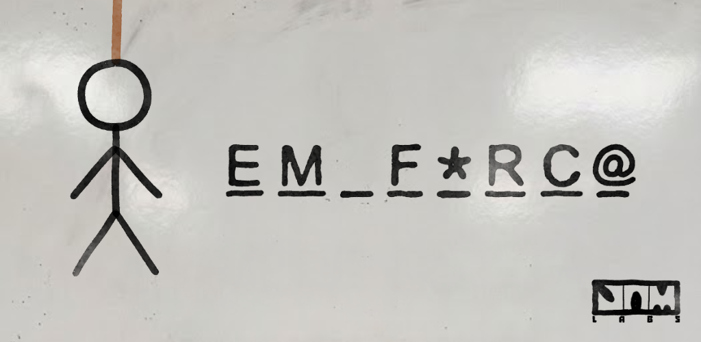

# 🪢 Em Forca (Mobile - Flutter)

Projeto desenvolvido na faculdade de Ciência da Computação pela equipe **JAM Labs**. A ideia foi pegar um jogo que já tínhamos feito em Java e transformar em uma versão mobile moderna usando Flutter.

Jogue Em Forca agora: <br>
<a href="https://play.google.com/store/apps/details?id=com.jamlabs.emforca" target="_blank">
  
</a>

---

## 📱 Sobre o projeto

Esse jogo começou como uma aplicação em Java com interface Swing e banco MySQL. Nesta versão recriada em Flutter, a arquitetura foi modernizada para rodar nativamente no celular e não depender de servidores externos.

* O jogo funciona totalmente offline.
* O banco de dados agora utiliza SQLite local otimizado.
* Interface totalmente adaptada e com suporte a exibições modernas (Edge-to-Edge).
* Sistema robusto de conquistas evolutivas integrado ao Google Play Games.

---

## 🎮 Como funciona e Modos de Jogo

O jogo conta com mecânicas aprimoradas para adivinhar a palavra secreta tendo um limite de 7 vidas. Durante a partida, você pode gastar corações para liberar dicas da palavra oculta. 

Oferecemos os seguintes modos:
* **1 Jogador:** Jogue sozinho escolhendo a dificuldade (Rodinhas, Fácil, Médio, Difícil). Um sistema de memória garante que as palavras não se repitam até que você zere a categoria inteira.
* **Multiplayer Clássico:** Rodadas fechadas e justas alternando o celular. O placar só computa a vitória e a derrota quando os dois jogadores finalizam seus turnos.
* **Cabo de Guerra:** Um duelo 1x1 onde o turno passa para o rival a cada letra errada. Ao perderem as vidas normais, ocorre uma "Morte Súbita" com um coração pulsante para definir o vencedor.
* **Modo Arquiteto:** Um jogador digita a palavra e a dica em segredo, configurando um desafio personalizado para o outro adivinhar.

---

## 🗂️ Categorias

O catálogo expandiu e hoje conta com uma vasta diversidade de temas para desafiar os jogadores:
* Filmes e Séries
* Esportes
* Tecnologia
* Comidas e Bebidas
* Música (e Música - Cantores)
* Mitologia
* Contos de Fada
* Países
* Jogos

---

## 🛠️ Tecnologias

* Flutter & Dart
* SQLite (sqflite) para banco embarcado
* games_services para o Google Play Games
* flutter_animate para transições de UI
* Google Fonts

---

## 📁 Organização do projeto

A estrutura foi refatorada para uma melhor separação de responsabilidades:
* `main.dart` → Inicialização do app e configurações de interface.
* `models/` → Estrutura de dados das palavras.
* `database/` → Gerenciamento inteligente e protegido do banco SQLite.
* `screens/` → Telas de jogo, seleção de modo multiplayer e hub de conquistas.
* `widgets/` → Componentes reutilizáveis, como o teclado virtual e as animações do boneco da forca.
* `core/services/` → Regras de negócio, mapeamento de IDs e integração em nuvem.
* `theme/` → Estilos, identidades visuais de "quadro branco" e paletas pastel.

---

## 🔄 Adicionando Palavras (Sem perder progresso)

As palavras são inseridas através do método inicial no `lib/database/database_helper.dart`.

Na versão atual, as tabelas de `pontuacao` e `estatisticas` utilizam `CREATE TABLE IF NOT EXISTS`. Isso significa que, ao adicionar novas palavras e aumentar a versão do banco (`version: x`), o sistema recria **apenas** a tabela de palavras. O seu placar de duelos, total de vitórias e progresso de conquistas estão permanentemente blindados contra atualizações.

Formato para adicionar:
```dart
{'texto': 'PALAVRA', 'dica': 'Alguma dica', 'categoria': 'Categoria', 'dificuldade': 'medio'},
```

## 🚀 Rodando o projeto

git clone [https://github.com/AugustoCGM/Em_forca.git]
<br>cd jogo-forca-flutter
<br>flutter pub get
<br>flutter run

📸 O que o jogo tem
Sistema estratégico de vidas e punições.

Dicas com custo de corações.

Três modos de duelo para 2 jogadores com placares armazenados localmente.

Card evolutivo de progresso nas categorias.

Conquistas no Google Play com recompensas e Easter Eggs.

Animações em tela cheia para troca de turnos no multiplayer.

👨‍💻 Autores
Projeto desenvolvido pela equipe JAM Labs como parte das atividades da faculdade de Ciência da Computação:

- Augusto César
- Carlos Joab
- Arthur Vinícius
- Michael Domingos

📄 Licença
Uso livre para estudo.
